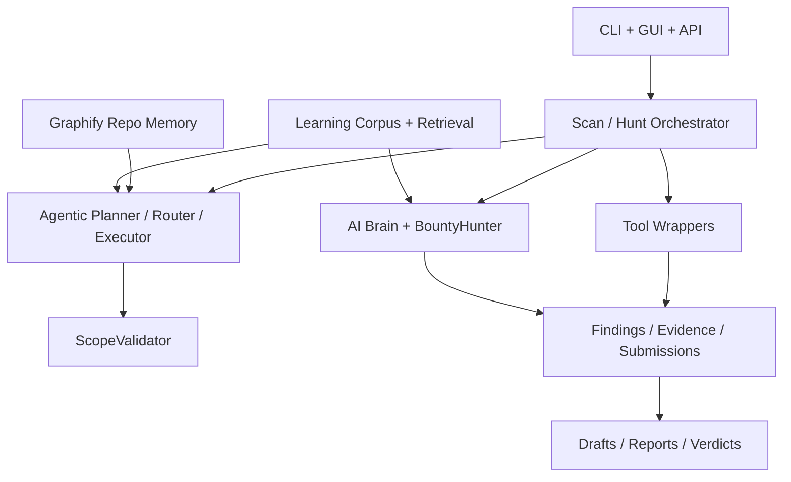

# NETRA

NETRA is a local-first security orchestration platform for vulnerability assessment, reporting, and bug bounty operations.

Version `1.0.0` marks the first release where the core platform and the NETRA-BB bug bounty workflow can be run end to end on a self-hosted stack.

## What NETRA v1 includes

### Core security platform
- Scan orchestration across recon, enumeration, and validation phases
- Local database for scans, findings, evidence, and reports
- AI-assisted analysis with multi-persona reasoning
- Report generation for operational and review workflows
- Docker-based local deployment

### NETRA-BB bug bounty workflow
- Program registry with scope-sync for supported platforms
- Hard scope-gate enforcement before external actions
- Agentic hunt planning, routing, and execution
- PoC drafting with verifier allowlists and replay controls
- Submission draft workflow with verdict tracking
- Audit trails for scope blocks and UI actions
- Learning corpus ingestion from public prior art
- Graphify-backed repo memory for lower-token reasoning

### Learning and retrieval
- HackerOne hacktivity ingestion
- GHSA / NVD advisory ingestion
- Public RSS/writeup ingestion
- Redact -> embed -> upsert corpus pipeline
- Local retrieval for planning, scoring, and drafting
- `pgvector` acceleration on PostgreSQL with safe local fallback

## Architecture at a glance



## Quick start

### 1. Clone and configure

```bash
git clone https://github.com/yashwarrdhangautam/Netra.git
cd Netra
cp .env.example .env
```

Fill in the credentials you want to use. For bug bounty workflows, the important ones are:
- `H1_API_USERNAME`
- `H1_API_TOKEN`
- `OLLAMA_BASE_URL`
- `NETRA_DATABASE_URL` if you are using PostgreSQL outside Docker

### 2. Start the stack

```bash
docker compose up --build
```

### 3. Verify readiness

```bash
poetry run netra-bb doctor
```

### 4. Open the GUI

- BB console: [http://localhost:5173/bb](http://localhost:5173/bb)
- API health: [http://localhost:8000/api/v1/health](http://localhost:8000/api/v1/health)

## Example bug bounty flow

```bash
# Register a program
poetry run netra-bb add-program --platform hackerone --handle shopify

# Preview an agentic plan
poetry run netra-bb plan --program shopify --asset api.shopify.com

# Run a passive hunt
poetry run netra-bb hunt --program shopify --profile passive --agentic

# Explain what happened
poetry run netra-bb hunt-explain <scan_id>

# Review trends from the local learning corpus
poetry run netra-bb trend
```

## Safety model

NETRA-BB is intentionally conservative.

- Scope decisions are enforced in code, not delegated to the model
- Verifiers are allowlisted and read-only by default
- The operator remains the only path to state-mutating actions
- Public prior art is used for reasoning, but guarded against verbatim leakage into submission drafts
- Learning sources respect robots policies, rate limits, and source toggles

## Learning corpus storage

NETRA does not fine-tune a model. It stores structured public prior art locally and retrieves only the relevant context when needed.

Storage layers:
- **Graphify graph** for repo and architecture memory
- **Learning corpus tables** for reports, writeups, advisories, and trends
- **Local embeddings** with version tracking
- **`pgvector` columns** on PostgreSQL for faster similarity search

Useful commands:

```bash
poetry run netra-bb trend
poetry run netra-bb corpus forget --author <handle> --confirm FORGET
poetry run netra-bb corpus reembed --confirm REEMBED
```

## Repository layout

```text
src/netra/                 Python application code
frontend/                  React GUI
alembic/                   Database migrations
docs/                      Product and operator documentation
docker/                    Container assets
tests/                     Automated tests
verifier_allowlist.yaml    Allowed replay/verification policies
```

## Development

### Backend

```bash
poetry install
$env:PYTHONPATH="src"
pytest
```

### Frontend

```bash
cd frontend
npm install
npm.cmd run build
```

### Database

```bash
$env:PYTHONPATH="src"
alembic upgrade head
```

## Documentation

- [Bug bounty operator guide](docs/bugbounty.md)
- [API reference](docs/api.md)
- [Installation](docs/installation.md)
- [Configuration](docs/configuration.md)
- [NETRA-BB PRD](docs/NETRA_BB_PRD.md)
- [NETRA-BB GUI PRD](docs/NETRA_BB_GUI_PRD.md)
- [NETRA-BB Learning PRD](docs/NETRA_BB_LEARNING_PRD.md)
- [NETRA-BB Capability PRD](docs/NETRA_BB_CAPABILITY_PRD.md)

## Release status

This repository is being prepared as the `v1.0.0` release line.

The platform is ready for:
- local deployment
- real bug bounty workflow trials
- learning-corpus ingestion
- agentic passive hunts

The next work after v1 is expected to come from real operator feedback rather than more broad scaffolding.

## License

Licensed under the [AGPL-3.0](LICENSE).
