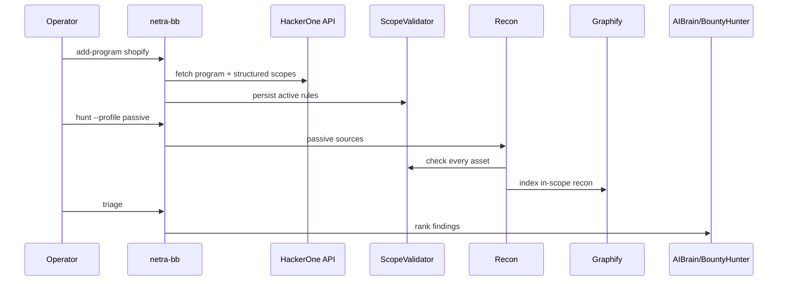
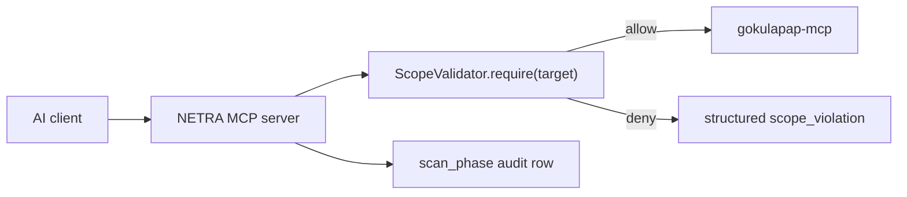
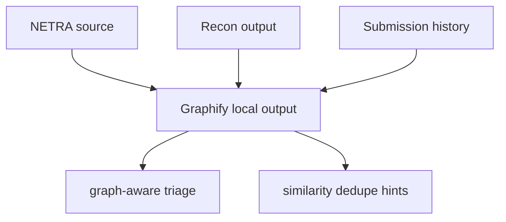

# NETRA-BB Operator Guide

NETRA-BB is the bug bounty mode for NETRA. It keeps platform scope in the database,
runs passive-first recon through `ScopeValidator`, ranks findings with the
BountyHunter AI persona, and stores local Graphify output for codebase/recon indexing.

## Basic Flow

1. Register a program:

   ```bash
   netra-bb add-program --platform hackerone --handle shopify --name Shopify
   ```

2. Add or sync active scope rules. Until platform sync is wired for every provider,
   use the existing program/scope services or migrations to seed `bb_scope_rules`.

3. Check scope before hunting:

   ```bash
   netra-bb scope --program shopify --check api.shopify.com
   netra-bb scope --program shopify --list
   ```

4. Run a passive hunt:

   ```bash
   netra-bb hunt --program shopify --profile passive
   ```

5. Run active checks only when the program allows them:

   ```bash
   netra-bb hunt --program shopify --profile active --enable-nuclei
   ```

6. Review findings ranked by BountyHunter:

   ```bash
   netra-bb triage --program shopify --limit 20
   ```

7. Build/update the local code graph:

   ```bash
   netra-bb graphify index-codebase
   ```

## Architecture Diagrams

Lifecycle:



MCP federation:



Graphify:



## Safety Rules

- Passive recon sources are public-only: subfinder passive mode, crt.sh, amass passive,
  and GitHub code search when `GITHUB_TOKEN` is present.
- Active recon rechecks every target with `ScopeValidator.require()` before probing.
- Out-of-scope matches are denied by default and recorded in phase output.
- Auto-submission is intentionally not implemented. Operators manually paste the final
  report into the platform UI.

## Docker GUI Console

The NETRA-BB operator console is available in the Docker stack:

```bash
docker compose up --build
```

Open `http://localhost:5173/bb` after the stack is healthy. The frontend is an nginx
container serving the Vite build and proxying `/api/*` to the FastAPI service.

Implemented console surfaces:

- `/bb` - BB dashboard with aggregate counts, recent hunts, readiness checks, and
  visible scope-block warnings.
- `/bb/programs` - register programs and sync platform scope when credentials are
  configured.
- `/bb/scope` - inspect scope rules, run the server-side `ScopeValidator`, and view
  recent blocked targets.
- `/bb/hunts` - launch passive or explicitly confirmed active BB hunts and cancel
  pending/running hunts.
- `/bb/triage` - view ranked BB findings with BountyHunter score, Skeptic veto state,
  and dedup/similarity hints.
- `/bb/submissions` and `/bb/submissions/<id>` - list, edit, render, transition,
  and ingest verdicts for submission drafts.
- `/bb/audit` - review scope-block audit rows.
- `/bb/findings/<id>` - PoC Lab for evidence upload, redaction/encryption storage,
  verifier allowlist review, and read-only replay.
- `/bb/graph` - hierarchical program graph and cached Graphify codebase status.
- `/bb/doctor` - mirror `netra-bb doctor` in the browser.

Compose now includes the production frontend image, a one-shot `migrations` service,
Celery `worker`, Celery `beat`, Postgres, Redis, and shared volumes for evidence,
Graphify output, and raw NETRA output. Set platform credentials in your shell or
`.env` before starting the stack:

```bash
H1_API_USERNAME=...
H1_API_TOKEN=...
GITHUB_TOKEN=...
docker compose up --build
```

The GUI uses the same backend gates as the CLI. Scope checks are performed server-side
through `/api/v1/bb/scope/check`; hunt creation stores `program_id` in the scan config
so the BB orchestrator can load active rules before recon touches anything.

Evidence uploaded through the GUI is redacted before storage, encrypted under the
NETRA evidence key, and tracked in `bb_evidence` plus `bb_evidence_redactions`.
Replay uses `verifier_allowlist.yaml`; only read-only methods from the allowlist are
allowed, and every replay re-runs the server-side scope validator before touching the
target. The top-bar kill switch requires typing `STOP` and cancels all active BB hunts.

Production-mode guardrails:

- `/api/v1/bb/*` requires Bearer authentication when `NETRA_ENVIRONMENT=production`.
- Mutating BB calls require `admin` or `analyst` roles.
- Mutating BB calls require `X-CSRF-Token`; if the `netra_csrf` cookie is present the
  header must match it.
- Every successful mutating BB API call writes an `audit_ui_actions` row.

Quality gates added for the GUI:

```bash
cd frontend
npm run build
npm test
```

The Playwright suite includes a BB console smoke test and an axe-core serious/critical
accessibility check. `tests/contract/test_bugbounty_openapi.py` is a Schemathesis
contract smoke for the BB OpenAPI surface and runs when Schemathesis is installed.
